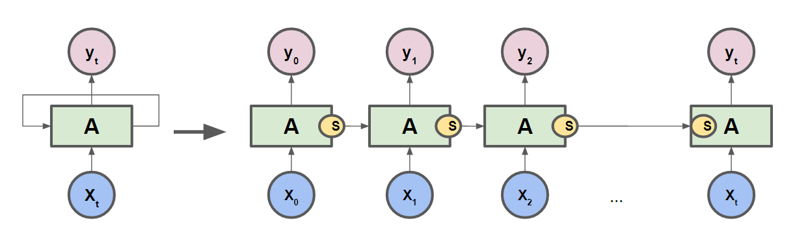
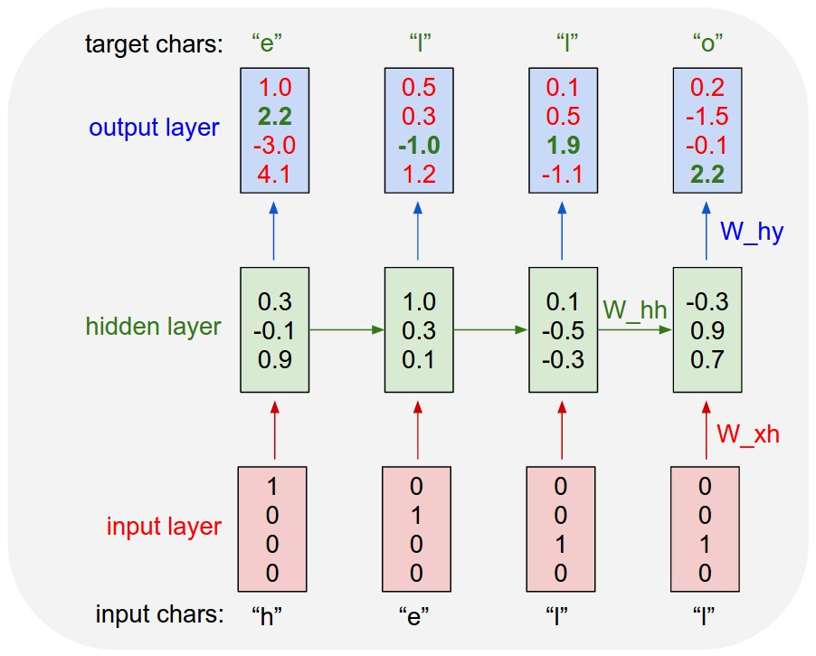

# 인공지능 작곡 프로그램

---

# 개요

본 프로젝트에서는 TensorFlow RNN을 이용한 인공지능 작곡 프로그램을 설계, 구현한다. 작곡을 하기 위해서는 ASCII 코드로 표기된 ABC Notation 악보를 학습하고, 이를 기반으로 악보를 생성한다.

---

# 사용 기술

## TensorFlow [1]

 
[그림 1] TensorFlow 로고

TensorFlow는 다양한 작업에대해 데이터 흐름 프로그래밍을 위한 오픈소스 소프트웨어 라이브러리이다. 심볼릭 수학 라이브러리이자, 뉴럴 네트워크같은 기계학습 응용프로그램에도 사용된다. 이것은 구글내 연구와 제품개발을 위한 목적으로 구글 브레인팀이 만들었고 2015년 11월 9일 아파치 2.0 오픈소스 라이센스로 공개되었다.

텐서플로는 파이썬 API 를 제공하며 문서화가 약간 부족하지만 C/C++ API 도 제공한다.

## Neural Network

생물학적 신경망에서 영감을 받아 만든 알고리즘이며 많은 입력을 통해 베일에 싸인 함수를 추측하고 근사치를 내는데 사용하는 통계학적 학습 알고리즘이다.

## RNN (Recurrent Neural Network) [2]

RNN이란 Sequence 데이터를 처리하는 모델로서 현재의 상태가 다음 상태에 영향을 미치는 Network으로 현재의 아웃풋이 다음의 인풋이 된다.

 
[그림 2] 현재의 결과에서 나온 state를 다음 값에 영향을 준다

그리고 이러한 과거의 결과에 영향을 받은 네트워크 구조이기 때문에 ‘기억 능력’이 있다고 한다. 사람으로 치면 현재 생각하고 판단하는 과정에서 과거의 기억에 의존하는 것과 비슷하다고 볼 수 있다.

## Char_RNN [3]

RNN을 활용한 글자를 생성하는 알고리즘이다. ‘ 현재의 글자는 과거의 글자와 연관이 있으므로 다음에 나올 확률이 높다 ’ 라는 생각에서 출발했다. ‘ 전처리 -> 트레이닝 -> 샘플링 ’ 이 3단계로 나누어져 있다.

### 1) 전처리 (Preprocess)

텍스트 데이터셋을 글자(Char)단위로 쪼개고 각 글자마다 숫자를 할당한다. 그리고 맵핑을 한다.

### 2) Training

인풋 데이터(x)에서 글자를 하나 뒤로 민 타겟 데이터(y)를 RNN 모델로 학습 시킨다.

 
[그림 3] hello를 학습시키는 모델

### 3) Sampling

학습된 모델을 토대로 샘플링을 통해 임의의 글자를 생성한다. 

첫 글자를 공백으로 input으로 넣고 다음 글자를 예측한다. 이후 예측된 값을 input에 넣고 예측한다. 이 과정을 반복한다.

---

# 학습 데이터셋 [4]

단순한 포크송 형태의 기본적인 미디 데이터셋으로 Nottingham Database를 사용한다.

Nottingham Database는 1200개의 영국/미국 포크곡으로 이루어져 있는 데이터셋으로, ABC Notation 및 MIDI 형식으로 제공된다.

음악 AI 스타트업 JukeDeck에서 이 데이터셋을 한번 더 정리해서 Github에 공유한 것을 사용한다.

[데이터셋 Github 링크](https://github.com/jukedeck/nottingham-dataset)

## 용어 설명

- ### ABC Notation [5]

ABC 기보법은 기보법의 축약된 형태이다.

ABC 표기법(ABCnotation,ABC 기보법)은 음악 표기법의 일종으로 중요해진 형식이다. 기본형에서는 A부터 G까지의문자를 사용하여 주어진 음을 나타낸다. 다른 요소는 음영, 길이, 장식의 길이와 같이 다양한 옵션이 추가됐다. 이후에 컴퓨터가 주요의사 소통 수단으로 등장하면서 사용자들은 온라인 음악 공유를 용이하게하고 소프트웨어 개발자를위한 새로운 언어를 추가하는 ASCII 코드로 이 형식의 표기법을 사용할 수있는 가능성을 보았다. 이경우 ASCII 문자 세트를 미리 정의된 용도로 사용한다. ABC 표기법은 ASCII 기반이며 모든 텍스트 편집기를 사용하여 음악을 편집할 수 있다.

- ### MIDI [6]

악기 디지털 인터페이스(영어: Musical Instrument Digital Interface 줄여서 MIDI/ˈmɪdi/)는 전자 악기끼리 디지털 신호를 주고 받기 위해 각 신호를 규칙화한 일종의 규약이다. 다시 말해 악기와 컴퓨터, 악기와 악기끼리 주고받을 수 있는 언어와 통로의 신호 체계 표준이라 할 수 있다.

---

# 처리 과정

1. ABC Notation 데이터셋을 Char_RNN에 학습
2. 학습 결과물 바탕으로 ABC Notation 생성
3. 사람이 직접 생성된 ABC Notation 중 유효 데이터 선별
4. ABC Notation을 MIDI 파일로 변환 [7]
5. MIDI 파일을 청취 가능한 mp3 파일로 변환 [8]

---

# References

[1] <https://ko.wikipedia.org/wiki/%ED%85%90%EC%84%9C%ED%94%8C%EB%A1%9C>

[2] <http://kslee7746.tistory.com/51>

[3] <http://solarisailab.com/archives/1620>

[4] <https://maclab-kaist.github.io/DeepArt/melody_rnn/MelodyRNN_01_introduction.html>

[5] <https://ko.wikipedia.org/wiki/ABC_%EA%B8%B0%EB%B3%B4%EB%B2%95>

[6] <https://ko.wikipedia.org/wiki/MIDI>

[7] <https://colinhume.com/music.aspx>

[8] <https://www.zamzar.com/convert/midi-to-mp3>